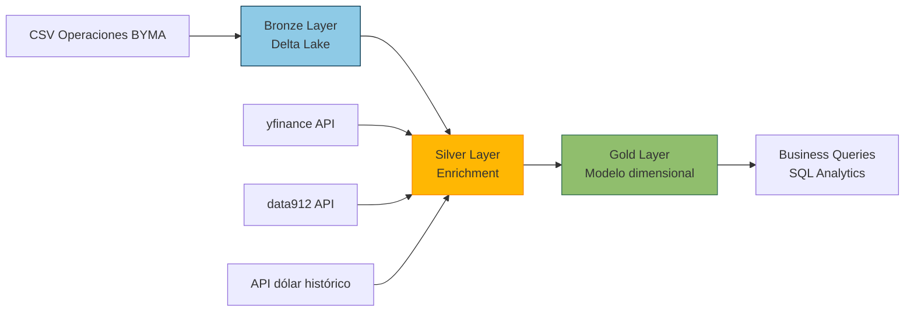

# 🏗️ Arquitectura de la solución

## 📌 Overview

La solución implementa un pipeline end-to-end sobre datos de operaciones bursátiles, siguiendo una arquitectura **Medallion (Bronze → Silver → Gold)** en **Delta Lake**, con enriquecimiento mediante APIs externas.

Flujo completo:

---

## 🔄 Diagrama de arquitectura

### 🥉 Bronze Layer – Ingesta

📂 Notebook: 01_ingesta_bronze

🔹 Descripción: Se realiza la ingesta del dataset original en formato CSV y se persiste en Delta Lake.

🔹 Output: bronze_byma.operaciones_raw

🔹 Transformaciones: Definición de schema explícito, conversión de tipos de datos, parseo de timestamps y generación de particiones

🔹 Tecnologías: PySpark y Delta Lake

🔹 Decisiones: Uso de Delta Lake por soporte ACID y escalabilidad. Particionamiento por fecha para optimizar consultas. Evitar inferencia automática de schema

### 🥈 Silver Layer – Enrichment

📂 Notebooks: 02_tipo_cambio_enrichment - 03_cotizaciones - 04_cotizaciones_vs_operaciones

🔹 Descripción: Se enriquece la información de operaciones con datos externos: Tipo de cambio diario, Cotizaciones de mercado

💱 Tipo de cambio

Tabla: silver_byma.tipo_cambio
Contiene el valor diario del dólar para conversiones.

📈 Cotizaciones

Fuentes utilizadas: yfinance (principal) - data912 (fallback) - argentinadatos (valor dolar)

Estrategia: Primero se intenta con yfinance la cual contiene mayormente las acciones internaciones, para simbolos nacionales se hace una iteración agregando ".BA" al final en la misma api. Si no existe el símbolo → fallback a data912. 
Trade-off: menor cobertura vs mejor performance

📊 Enriquecimiento

Se calculan métricas clave:

desvio_pct = (precio_operado - precio_mercado) / precio_mercado

🔹 Tecnologías: PySpark - Python (requests)
🔹 Decisiones clave: Priorizar yfinance por cobertura histórica, usar data912 solo como fallback, evitar múltiples llamadas innecesarias a APIs, Joins por fecha para consistencia temporal

### 🥇 Gold Layer – Modelo analítico

📂 Notebook: 05_modelado_dimensional

🔹 Descripción:Se construye un modelo dimensional orientado a análisis de negocio.

⭐ Fact Table: `fact_operaciones`

Métricas:
- monto
- cantidad
- precio_operado
- precio_mercado
- desvío
  
📐 Dimensiones:
   `dim_cliente`
   `dim_instrumento`
   `dim_fecha`
   `dim_canal`
   
🔹 Esquema: Star Schema
✔ Justificación: Mejora performance en queries analíticas, simplifica joins, facilita consumo en BI

📊 Capa analítica

📂 Notebook: Business Questions

Ejemplos: Clientes que operan con desvíos > 2% -  Top instrumentos por desvío - Volumen por canal (ARS vs USD) - Evolución Compra vs Venta

⚙️ Stack tecnológico

| Capa          | Tecnología           |
| ------------- | -------------------- |
| Storage       | Delta Lake           |
| Procesamiento | PySpark              |
| Orquestación  | Databricks Notebooks |
| APIs          | yfinance, data912    |
| Lenguaje      | Python + SQL         |

### 🚀 Decisiones de diseño

📦 Almacenamiento: Delta Lake - ACID - versionado - operaciones MERGE

📅 Particionamiento: Por year/month/day
Basado en fecha de operación
